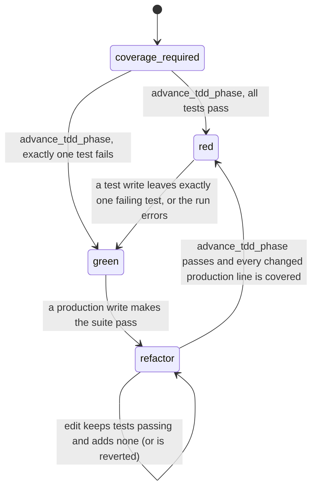

# Test-Driven Development MCP

An [MCP](https://modelcontextprotocol.io/) server that makes coding agents follow the
test-driven development cycle. Code files are written through this server, which only
allows each kind of change when the cycle permits it:



| Phase | Test files | Production files | Leaves when |
|---|---|---|---|
| `coverage_required` | locked | locked | `advance_tdd_phase` passes (red) or finds exactly one failing test (green) |
| `red` | writable | locked | a test write leaves exactly one failing test, or the tests can't be collected or run, with at most one test added since the cycle started |
| `green` | locked | writable | a production write makes the suite pass |
| `refactor` | writable | writable | `advance_tdd_phase` passes and covers every production line changed this cycle; any write that breaks tests or adds a test is reverted |

Every reply starts with `Phase: <phase>` and ends with what to do next, and every refusal says how
to get unstuck, so agents (including small local models) always know where they are in the cycle.

### One test at a time, no speculative code

The server counts tests from the runner's JUnit report. Red only advances when exactly one test
fails and no more than one test was added since the cycle started. Write one test, not a batch.
A Python test file that can't be imported yet counts as every `test*` function it defines.
A test run that can't collect or run the tests at all (e.g. a `conftest.py` importing code that
doesn't exist yet) also counts as the failing test, so programming by intention works from the
very first test.

The next cycle only starts when every production line changed since the cycle began (per `git diff`
against the commit at the start of the cycle, plus untracked files) is executed by some test, with
every branch on it taken. Coverage is measured with branches (`--cov-branch` for pytest; istanbul
branch counts for vitest), so an `if` whose false path no test takes counts as uncovered. Code
written for tests that don't exist yet shows up as uncovered and has to be removed. Refactoring
can't add tests to cover it either, because that's new behaviour, and new behaviour needs its own red.

Non-code files (docs, config, data) can be written in any phase once a cycle has started, and don't
trigger a test run.

## Tools

- `tdd_status(location)` — current phase and what it allows.
- `run_coverage(location, language="python")` — run the whole suite with coverage; starts each cycle. `language` is `python` or `typescript`.
- `run_tests(location, path=None, test_name=None)` — run tests without coverage, for fast iteration. By default it runs every test; `path` narrows it to a test file or folder, and `test_name` to matching tests (pytest `-k`, vitest `-t`). It never changes the phase: only `run_coverage` and the test runs that writes trigger do that.
- `write_file(location, path, content)` — create or overwrite a file, then run the tests.
- `edit_file(location, path, old_string, new_string)` — replace exactly one occurrence, then run the tests.

Paths must resolve inside `location`. Cycle state is kept in memory per project, so restarting the
server starts again at `coverage_required`.

### Commit every step

Each step's edits must be committed before the next step starts. Uncommitted changes (staged,
unstaged, or untracked; ignored files don't count) anywhere under `location` belong to the step
that was active when the tree was last clean. Repeat edits within that step are allowed, so a
red test or a green change can take several `edit_file` calls. The server refuses an edit when:

- the tree is dirty and no step is open (e.g. after a server restart or a `run_coverage` run,
  which ends the step), or
- the edit belongs to a later phase than the open step (e.g. production code after an
  uncommitted red test).

This applies to every file, including non-code and exempt files, and gives a history like:

```
. t Add failing test for add()
^ f Implement add()
. r Extract helper
```

The project must be a git repository. `advance_tdd_phase`, `run_coverage`, `run_tests`, and `tdd_status` aren't gated,
and Python coverage data is written to a temp directory so coverage runs don't dirty the tree.

## Languages

| Language | Test files | Tests run with |
|---|---|---|
| `python` | `test_*.py`, `*_test.py`, `conftest.py`, anything under `test/` or `tests/` | the project's `.venv` interpreter (or the server's) running `pytest`, with `pytest-cov` for coverage |
| `typescript` | `*.test.*`, `*.spec.*`, anything under `__tests__/`, `test/` or `tests/` (`.ts`, `.tsx`, `.mts`, `.cts`, and the `.js` equivalents) | the project's own `node_modules/vitest` via `node`, with `@vitest/coverage-v8` for coverage |

A collection error (such as importing a function that doesn't exist yet) counts as a failing
test. For TypeScript, install the runner in the project first: `npm install -D vitest @vitest/coverage-v8`.
If vitest is missing, the run is reported as an error rather than a failing test.

## Running the server

```bash
git clone <this repository>
cd TDD-MCP
mise run run
```

Example `.mcp.json`:

```json
{
  "mcpServers": {
    "tdd": {
      "command": "mise",
      "args": ["-C", "/path/to/TDD-MCP", "run", "run"]
    }
  }
}
```

For the cycle to be enforced, block the agent's built-in editing of code files. In Claude Code,
add to `.claude/settings.json`:

```json
{ "permissions": { "deny": ["Edit(**/*.py)", "Write(**/*.py)", "Edit(**/*.ts)", "Write(**/*.ts)"] } }
```

### Exempting files from the cycle

Set `TDD_MCP_EXEMPT` in the server's `env` to a comma-separated list of
[fnmatch](https://docs.python.org/3/library/fnmatch.html) patterns. Patterns match paths relative
to the project root, with `/` separators, and `*` also matches across directories. Once a cycle
has started, matching files can be written in any phase, with no failing test needed and no test run:

```json
"env": { "TDD_MCP_EXEMPT": "scripts/*, migrations/*, *.pyi" }
```

`"*"` exempts everything. An empty value, or leaving the variable unset, exempts nothing.
Restart the server after changing it.

## Contributing

See [CONTRIBUTING.md](CONTRIBUTING.md).
