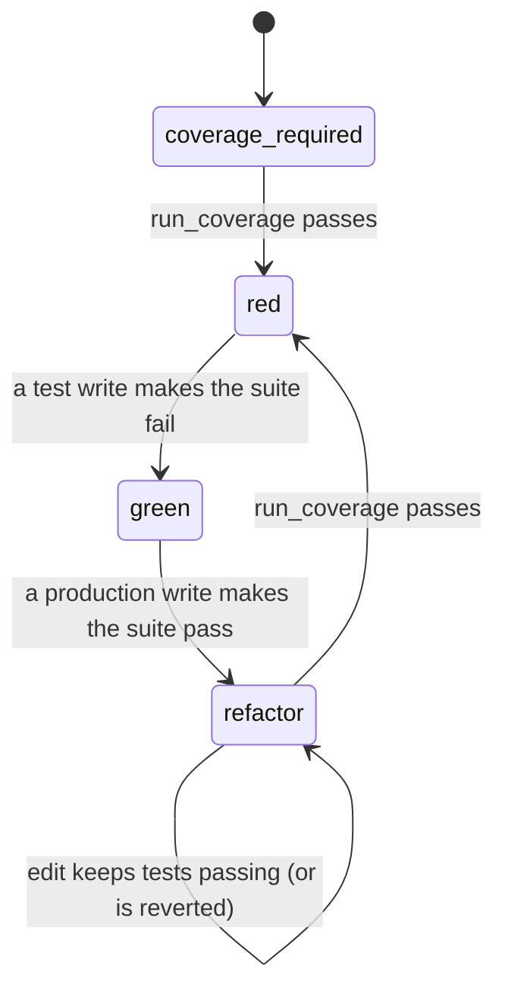

# Test-Driven Development MCP

An [MCP](https://modelcontextprotocol.io/) server that makes coding agents follow the
test-driven development cycle. Code files are written through this server, which only
allows each kind of change when the cycle permits it:



| Phase | Test files | Production files | Leaves when |
|---|---|---|---|
| `coverage_required` | locked | locked | `run_coverage` passes |
| `red` | writable | locked | a test write makes the suite fail |
| `green` | locked | writable | a production write makes the suite pass |
| `refactor` | writable | writable | `run_coverage` passes; any write that breaks tests is reverted |

Non-code files (docs, config, data) can be written in any phase once a cycle has started, and don't
trigger a test run.

## Tools

- `tdd_status(location)` — current phase and what it allows.
- `run_coverage(location, language="python")` — run the whole suite with coverage; starts each cycle. `language` is `python` or `typescript`.
- `run_tests(location, path=None, test_name=None)` — run tests without coverage, for fast iteration. By default it runs every test; `path` narrows it to a test file or folder, and `test_name` to matching tests (pytest `-k`, vitest `-t`). It never changes the phase: only `run_coverage` and the test runs that writes trigger do that.
- `write_file(location, path, content)` — create or overwrite a file, then run the tests.
- `edit_file(location, path, old_string, new_string)` — replace exactly one occurrence, then run the tests.

Paths must resolve inside `location`. Cycle state is kept in memory per project, so restarting the
server starts again at `coverage_required`.

### Commit every step

`write_file` and `edit_file` refuse to run while `git status` shows uncommitted changes (staged,
unstaged, or untracked; ignored files don't count) anywhere under `location`. This applies to
every file, including non-code and exempt files. Each step must be committed before the next
edit, which gives a history like:

```
. t Add failing test for add()
^ f Implement add()
. r Extract helper
```

The project must be a git repository. `run_coverage`, `run_tests`, and `tdd_status` aren't gated,
and Python coverage data is written to a temp directory so coverage runs don't dirty the tree.

## Languages

| Language | Test files | Tests run with |
|---|---|---|
| `python` | `test_*.py`, `*_test.py`, `conftest.py`, anything under `test/` or `tests/` | the project's `.venv` interpreter (or the server's) running `pytest`, with `pytest-cov` for coverage |
| `typescript` | `*.test.*`, `*.spec.*`, anything under `__tests__/`, `test/` or `tests/` (`.ts`, `.tsx`, `.mts`, `.cts`, and the `.js` equivalents) | the project's own `node_modules/vitest` via `node`, with `@vitest/coverage-v8` for coverage |

A collection error (such as importing a function that doesn't exist yet) counts as a failing
test. For TypeScript, install the runner in the project first: `npm install -D vitest @vitest/coverage-v8`.
If vitest is missing, the run is reported as an error rather than a failing test.

## Running the server

```bash
git clone <this repository>
cd TDD-MCP
mise run run
```

Example `.mcp.json`:

```json
{
  "mcpServers": {
    "tdd": {
      "command": "mise",
      "args": ["-C", "/path/to/TDD-MCP", "run", "run"]
    }
  }
}
```

For the cycle to be enforced, block the agent's built-in editing of code files. In Claude Code,
add to `.claude/settings.json`:

```json
{ "permissions": { "deny": ["Edit(**/*.py)", "Write(**/*.py)", "Edit(**/*.ts)", "Write(**/*.ts)"] } }
```

### Exempting files from the cycle

Set `TDD_MCP_EXEMPT` in the server's `env` to a comma-separated list of
[fnmatch](https://docs.python.org/3/library/fnmatch.html) patterns. Patterns match paths relative
to the project root, with `/` separators, and `*` also matches across directories. Once a cycle
has started, matching files can be written in any phase, with no failing test needed and no test run:

```json
"env": { "TDD_MCP_EXEMPT": "scripts/*, migrations/*, *.pyi" }
```

`"*"` exempts everything. An empty value, or leaving the variable unset, exempts nothing.
Restart the server after changing it.

## Contributing

See [CONTRIBUTING.md](CONTRIBUTING.md).
