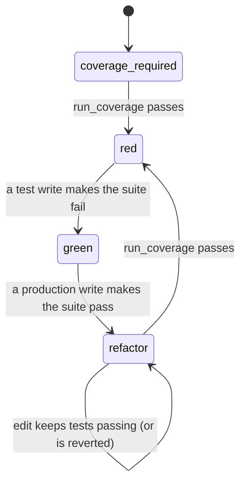

# Test-Driven Development MCP

An [MCP](https://modelcontextprotocol.io/) server that makes coding agents follow the
test-driven development cycle. Code files are written through this server, which only
allows each kind of change when the cycle permits it:



| Phase | Test files | Production files | Leaves when |
|---|---|---|---|
| `coverage_required` | locked | locked | `run_coverage` passes |
| `red` | writable | locked | a test write makes the suite fail |
| `green` | locked | writable | a production write makes the suite pass |
| `refactor` | writable | writable | `run_coverage` passes; any write that breaks tests is reverted |

Non-code files (docs, config, data) can be written in any phase once a cycle has started, and don't
trigger a test run.

## Tools

- `tdd_status(location)` — current phase and what it allows.
- `run_coverage(location, language="python")` — run the whole suite with coverage; starts each cycle.
- `write_file(location, path, content)` — create or overwrite a file, then run the tests.
- `edit_file(location, path, old_string, new_string)` — replace exactly one occurrence, then run the tests.

Paths must resolve inside `location`. Cycle state is kept in memory per project, so restarting the
server starts again at `coverage_required`.

## Languages

| Language | Test files | Tests run with |
|---|---|---|
| `python` | `test_*.py`, `*_test.py`, `conftest.py`, anything under `test/` or `tests/` | the project's `.venv` interpreter (or the server's) running `pytest`, with `pytest-cov` for coverage |

A pytest collection error (such as importing a function that doesn't exist yet) counts as a failing
test.

## Running the server

```bash
git clone <this repository>
cd TDD-MCP
mise run run
```

Example `.mcp.json`:

```json
{
  "mcpServers": {
    "tdd": {
      "command": "mise",
      "args": ["-C", "/path/to/TDD-MCP", "run", "run"]
    }
  }
}
```

For the cycle to be enforced, block the agent's built-in editing of code files. In Claude Code,
add to `.claude/settings.json`:

```json
{ "permissions": { "deny": ["Edit(**/*.py)", "Write(**/*.py)"] } }
```

## Contributing

See [CONTRIBUTING.md](CONTRIBUTING.md).
